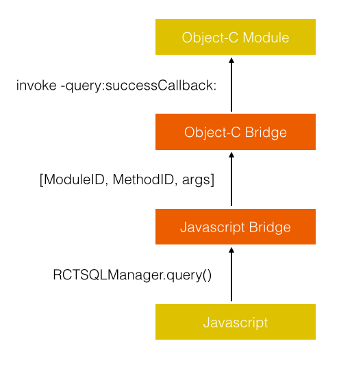

# React Native通信机制详解

## 概览

React Native用iOS自带的JavaScriptCore作为JS的解析引擎，但并没有用到JavaScriptCore提供的一些可以让JS与OC互调的特性，而是自己实现了一套机制，这套机制可以通用于所有JS引擎上，在没有JavaScriptCore的情况下也可以用webview代替，实际上项目里就已经有了用webview作为解析引擎的实现，应该是用于兼容iOS7以下没有JavascriptCore的版本。

普通的JS-OC通信实际上很简单，OC向JS传信息有现成的接口，像webview提供的-stringByEvaluatingJavaScriptFromString方法可以直接在当前context上执行一段JS脚本，并且可以获取执行后的返回值，这个返回值就相当于JS向OC传递信息。React Native也是以此为基础，通过各种手段，实现了在OC定义一个模块方法，JS可以直接调用这个模块方法并还可以无缝衔接回调。

举个例子，OC定义了一个模块RCTSQLManager，里面有个方法-query:successCallback:，JS可以直接调用RCTSQLManager.query并通过回调获取执行结果。：

```
//OC
@implement RCTSQLManager
- (void)query:(NSString *)queryData successCallback:(RCTResponseSenderBlOCk)responseSender
{
     RCT_EXPORT();
     NSString *ret = @"ret"
     responseSender(ret);
}
@end

//JS:
RCTSQLManager.query("SELECT * FROM table", function(result) {
     //result == "ret";
});
```

接下来看看它是怎样实现的。

## 模块配置表

首先OC要告诉JS它有什么模块，模块里有什么方法，JS才知道有这些方法后才有可能去调用这些方法。这里的实现是OC生成一份模块配置表传给JS，配置表里包括了所有模块和模块里方法的信息。例：

```
{
    "remoteModuleConfig": {
        "RCTSQLManager": {
            "methods": {
                "query": {
                    "type": "remote",
                    "methodID": 0
                }
            },
            "moduleID": 4
        },
        ...
     },
}
```

OC端和JS端分别各有一个bridge，两个bridge都保存了同样一份模块配置表，JS调用OC模块方法时，通过bridge里的配置表把模块方法转为模块ID和方法ID传给OC，OC通过bridge的模块配置表找到对应的方法执行之，以上述代码为例，流程大概是这样（先不考虑callback）：



在了解这个调用流程之前，我们先来看看OC的模块配置表式怎么来的。我们在新建一个OC模块时，JS和OC都不需要为新的模块手动去某个地方添加一些配置，模块配置表是自动生成的，只要项目里有一个模块，就会把这个模块加到配置表上，那这个模块配置表是怎样自动生成的呢？分两个步骤：

1. 取所有模块类

	每个模块类都实现了RCTBridgeModule接口，可以通过runtime接口objc_getClassList或objc_copyClassList取出项目里所有类，然后逐个判断是否实现了RCTBridgeModule接口，就可以找到所有模块类，实现在RCTBridgeModuleClassesByModuleID()方法里。
	
2. 取模块里暴露给JS的方法

	一个模块里可以有很多方法，一些是可以暴露给JS直接调用的，一些是私有的不想暴露给JS，怎样做到提取这些暴露的方法呢？我能想到的方法是对要暴露的方法名制定一些规则，比如用RCTExport\_作为前缀，然后用runtime方法class\_getInstanceMethod取出所有方法名字，提取以RCTExport\_为前缀的方法，但这样做恶心的地方是每个方法必须加前缀。React Native用了另一种黑魔法似的方法解决这个问题：编译属性\_\_attribute\_\_。
	
	在上述例子中我们看到模块方法里有句代码：RCT\_EXPORT()，模块里的方法加上这个宏就可以实现暴露给JS，无需其他规则，那这个宏做了什么呢？来看看它的定义：
	
	```
	#define RCT_EXPORT(JS_name) __attribute__((used, section("__DATA,RCTExport" \
))) static const char *__rct_export_entry__[] = { __func__, #JS_name }
	```
	
	这个宏的作用是用编译属性__attribute__给二进制文件新建一个section，属于__DATA数据段，名字为RCTExport，并在这个段里加入当前方法名。编译器在编译时会找到__attribute__进行处理，为生成的可执行文件加入相应的内容。效果可以从linkmap看出来：
	
	```
	# Sections:
# Address Size Segment Section
0x100001670 0x000C0180 __TEXT __text
...
0x10011EFA0 0x00000330 __DATA RCTExport
0x10011F2D0 0x00000010 __DATA __common
0x10011F2E0 0x000003B8 __DATA __bss
...
0x10011EFA0 0x00000010 [ 4] -[RCTStatusBarManager setStyle:animated:].__rct_export_entry__
0x10011EFB0 0x00000010 [ 4] -[RCTStatusBarManager setHidden:withAnimation:].__rct_export_entry__
0x10011EFC0 0x00000010 [ 5] -[RCTSourceCode getScriptText:failureCallback:].__rct_export_entry__
0x10011EFD0 0x00000010 [ 7] -[RCTAlertManager alertWithArgs:callback:].__rct_export_entry__
...
	```
	
可以看到可执行文件数据段多了个RCTExport段，内容就是各个要暴露给JS的方法。这些内容是可以在运行时获取到的，在RCTBridge.m的RCTExportedMethodsByModuleID()方法里获取这些内容，提取每个方法的类名和方法名，就完成了提取模块里暴露给JS方法的工作。

整体的模块类/方法提取实现在RCTRemoteModulesConfig()方法里。

## 调用流程

接下来看看JS调用OC模块方法的详细流程，包括callback回调。这时需要细化一下上述的调用流程图：


看起来有点复杂，不过一步步说明，应该很容易弄清楚整个流程，图中每个流程都标了序号，从发起调用到执行回调总共有11个步骤，详细说明下这些步骤：

1. JS端调用某个OC模块暴露出来的方法。

2. 把上一步的调用分解为ModuleName,MethodName,arguments，再扔给MessageQueue处理。在初始化时模块配置表上的每一个模块都生成了对应的remoteModule对象，对象里也生成了跟模块配置表里一一对应的方法，这些方法里可以拿到自身的模块名，方法名，并对callback进行一些处理，再移交给MessageQueue。具体实现在BatchedBridgeFactory.js的_createBridgedModule里，整个实现区区24行代码，感受下JS的魔力吧。

3. 在这一步把JS的callback函数缓存在MessageQueue的一个成员变量里，用CallbackID代表callback。在通过保存在MessageQueue的模块配置表把上一步传进来的ModuleName和MethodName转为ModuleID和MethodID。

4. 把上述步骤得到的ModuleID,MethodId,CallbackID和其他参数argus传给OC。至于具体是怎么传的，后面再说。

5. OC接收到消息，通过模块配置表拿到对应的模块和方法。
	
	实际上模块配置表已经经过处理了，跟JS一样，在初始化时OC也对模块配置表上的每一个模块生成了对应的实例并缓存起来，模块上的每一个方法也都生成了对应的RCTModuleMethod对象，这里通过ModuleID和MethodID取到对应的Module实例和RCTModuleMethod实例进行调用。具体实现在_handleRequestNumber:moduleID:methodID:params:。

6. RCTModuleMethod对JS传过来的每一个参数进行处理。


	RCTModuleMethod可以拿到OC要调用的目标方法的每个参数类型，处理JS类型到目标类型的转换，所有JS传过来的数字都是NSNumber，这里会转成对应的int/long/double等类型，更重要的是会为block类型参数的生成一个block。
	
	例如-(void)select:(int)index response:(RCTResponseSenderBlock)callback 这个方法，拿到两个参数的类型为int,block，JS传过来的两个参数类型是NSNumber,NSString(CallbackID)，这时会把NSNumber转为int，NSString(CallbackID)转为一个block，block的内容是把回调的值和CallbackID传回给JS。
	这些参数组装完毕后，通过NSInvocation动态调用相应的OC模块方法。

7. OC模块方法调用完，执行block回调。

8. 调用到第6步说明的RCTModuleMethod生成的block。

9. block里带着CallbackID和block传过来的参数去调JS里MessageQueue的方法invokeCallbackAndReturnFlushedQueue。

10. MessageQueue通过CallbackID找到相应的JS callback方法。

11. 调用callback方法，并把OC带过来的参数一起传过去，完成回调。

整个流程就是这样，简单概括下，差不多就是：JS函数调用转ModuleID/MethodID -> callback转CallbackID -> OC根据ID拿到方法 -> 处理参数 -> 调用OC方法 -> 回调CallbackID -> JS通过CallbackID拿到callback执行


## 事件响应

上述第4步留下一个问题，JS是怎样把数据传给OC，让OC去调相应方法的？

答案是通过返回值。JS不会主动传递数据给OC，在调OC方法时，会在上述第4步把ModuleID,MethodID等数据加到一个队列里，等OC过来调JS的任意方法时，再把这个队列返回给OC，此时OC再执行这个队列里要调用的方法。

一开始不明白，设计成JS无法直接调用OC，需要在OC去调JS时才通过返回值触发调用，整个程序还能跑得通吗。后来想想纯native开发里的事件响应机制，就有点理解了。native开发里，什么时候会执行代码？只在有事件触发的时候，这个事件可以是启动事件，触摸事件，timer事件，系统事件，回调事件。而在React Native里，这些事件发生时OC都会调用JS相应的模块方法去处理，处理完这些事件后再执行JS想让OC执行的方法，而没有事件发生的时候，是不会执行任何代码的，这跟native开发里事件响应机制是一致的。

说到OC调用JS，再补充一下，实际上模块配置表除了有上述OC的模块remoteModules外，还保存了JS模块localModules，OC调JS某些模块的方法时，也是通过传递ModuleID和MethodID去调用的，都会走到-enqueueJSCall:args:方法把两个ID和参数传给JS的BatchedBridge.callFunctionReturnFlushedQueue，跟JS调OC原理差不多，就不再赘述了。

## 总结

整个React Native的JS-OC通信机制大致就是这样了，关键点在于：模块化，模块配置表，传递ID，封装调用，事件响应，其设计思想和实现方法很值得学习借鉴。

